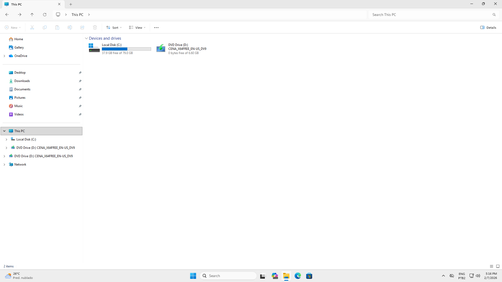
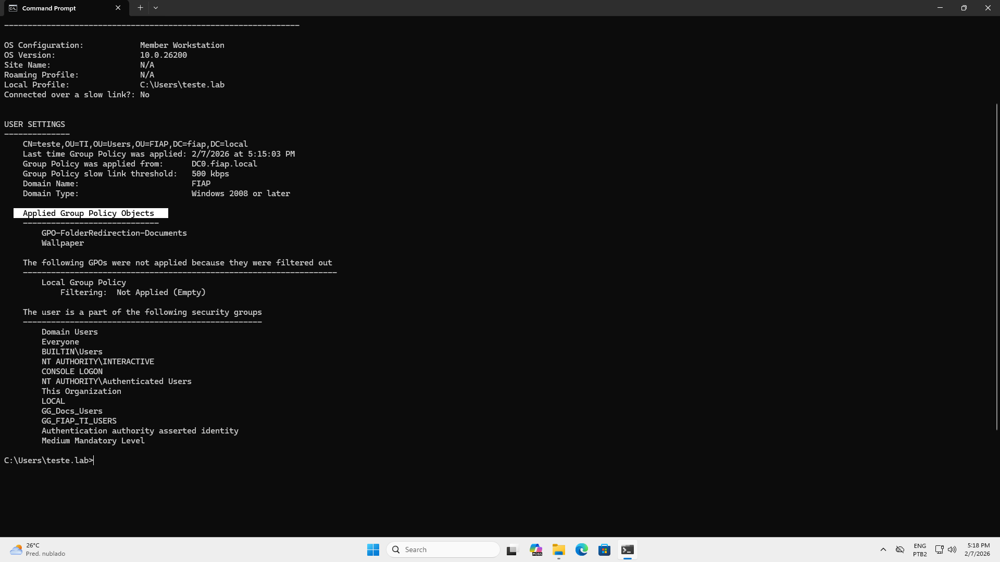
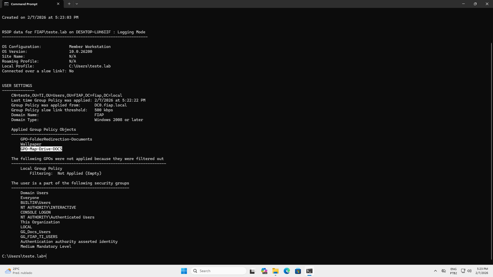

**Runbook usado:** [GPO - Não Aplica](/runbooks/GPO/gpo-nao-aplica.md)

- Sintoma: drive Z não aparece
- Diagnóstico: GPO não aplicada por security filtering
- Resolução: corrigido security filtering / grupo correto
- Validação: gpresult mostra GPO aplicada + drive mapeado

# Evidências

**Sem drive Z**

**gpresult /r**

**Drive volta**

**gpresult /r(2)**

**Event viewer**
